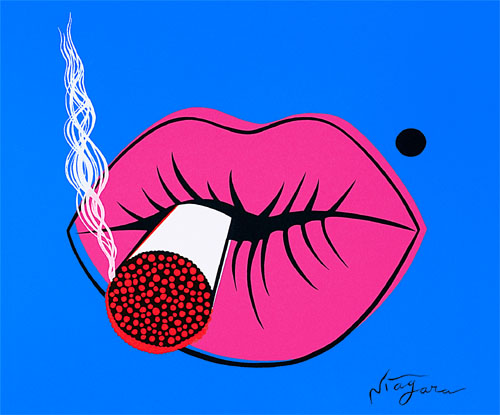
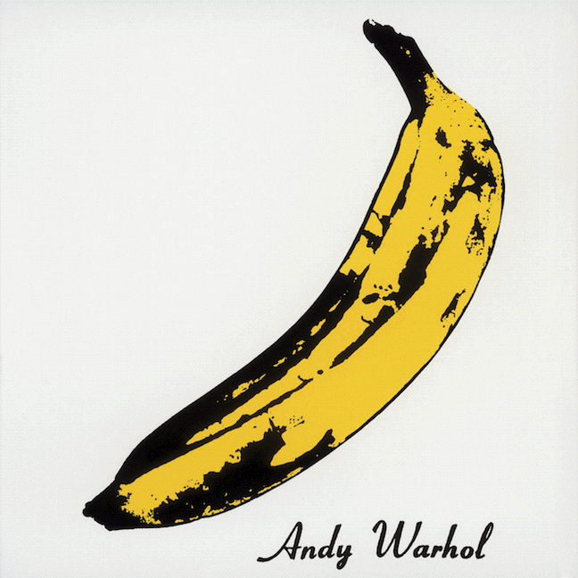
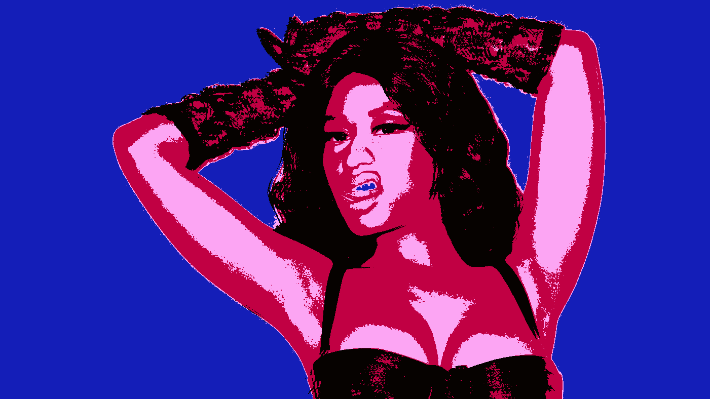
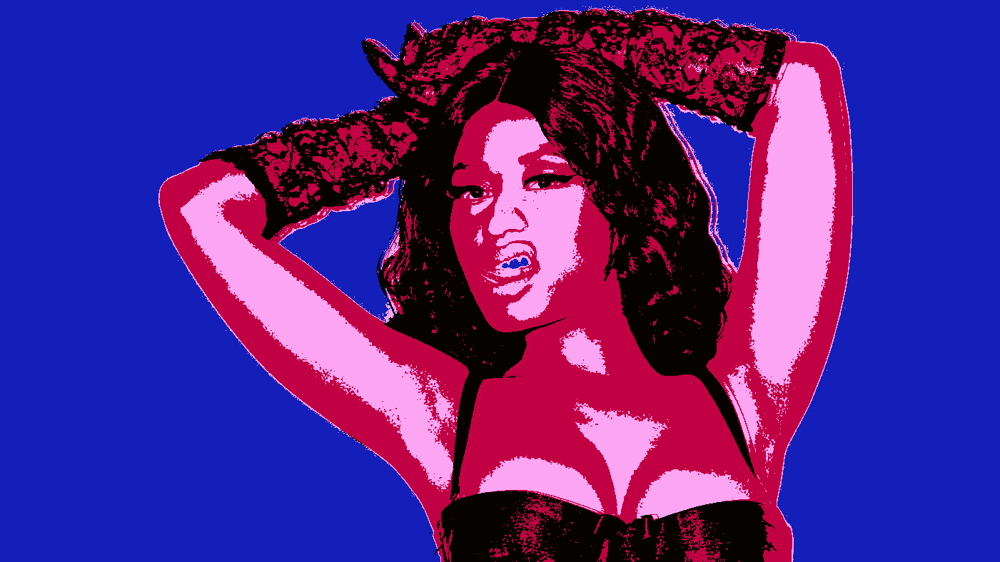

# What I learned from glitching images

To begin any custom image manipulation, you have to begin with math. The amount of math is quantifiable to the amount of manipulation you want to achieve. I will supply my formula and if in trying to achieve an effect you get stuck, Google is your friend as it’s been a great ally of mine. Also you can leave a comment and I will reply as quickly as I can.

This is going to be the source image for the tests. I do not own rights to the image, they belong to their respective copyright holders. honestly this more like “borrowing” Nicki.


The number 255 is derived from the way information is stored. In computing you have several types of containers that you can store values ​​in. Once that value gets to large, in advanced computing the value overflows into another value, more commonly it rewinds back to the lowest possible value or it is clamped. Clamping is limiting the value to its upper or lower bounds, 0 or 255 in this case.

The number systems used in computing tries to represent each value in binary. 0 is 0, 1 is 1, but is 10 2, 11 3 is, 100 is 4, etc. We say a number is an 8-bit number because it's maximum value is 11111111, or 255. In programming languages ​​like Javascript, every number is assumed to be 64 bit. In this case one is actually represented as:
0000000000000000000000000000000000000000000000000000000000000001
which is why programs running on your web browser can eat up so much memory. In older, more pragmatic languages ​​the amount of 1's and 0's that can fit into a value determines its type. What we want is an unsigned 8 bit integer, in C this is represented by uint8_t (if the stdint.h library is included in the program). Integer types refer to numbers. Unsigned means that the program will assume every value is positive. A signed integer type, -19 or -5 for example, is only capable of representing half the set of numbers in either positive or negative.

A number type on it's own will not accomplish much, there has to be a data structure to hold all the numbers and keep them in a row. It is traditionally agreed that an effective structure for representing multiple numbers is a list or array type. An array is just what it sounds like, bits stored in a list with a record of where each item is placed, arrays are indexed starting at zero instead of one for efficiency. For example this structure '[1, 2, 3, 4, 5]' means that the position of 0 holds the value of 1, position 1 holds the value of 2 etc. To access a value in such a structure you give the name of the array followed then by square brackets and the position you want the value for.

**Figure 1.a**  _Demo Array_
```javascript
    // positions: 0 1 2 3 4 5
     var myArray = [ 0, 0, 255, 0 ,0, 255];
    // positionThree is 255, 
     var positionThree = myArray[2];
```
Newer Javascript engines expose a data structure call ArrayBuffer to keep the memory footprint of data small. In an ArrayBuffer (or Buffer in Node.js) each position represents the binary data for each position. It helps to think of the data as one continuous stream of numbers. From the ArrayBuffer you can then create a view that automatically assembles the binary data into a structure that you can consume. For Images it is best to stick to a Uint8Array or Uint8ClampedArray although Uint16Array and Uint32Array are also available. This means when you pull the information from position one in this structure that data returned is exactly 8 bits so 255 is '11111111' instead of
'0000000000000000000000000000000000000000000000000000000011111111'.

The way that pixels are ordered is how color spaces work. A color space, RGB for example implies that in an array of '[0,0,255]' is arranged with the red value first, the blue second and the green third, so in this example the interpreting program agrees that in the first position the value of 0 infers that there is no red in this pixel, the second position infers that there is no green in this pixel, the third position infer that the pixel contains the maximum blue value. In a perfect world each pixel would be self contained in its own array thus making up a matrix of pixels, however assigning an individual array for each pixel would consume just as much memory as the pixel values ​​themselves, possibly even more depending on the programming environment . Each pixel is instead placed immediately after the previous in the color array [0,0,255, 0,0,255, 0,0,255]. To iterate through each pixel a looping or recursive structure is used. A more traditional for loop can look like this:

**Figure 1.b**  _Traditional pixel for loop structure_
```javascript
    for (var x = 0; x < imageHeight; x++) {
     for (var y = 0; y < imageWidth; y++) {
      var currentPixelIndex = (x*imageWidth*3) + (y*3)
      // pixelArray is assumed to be the structure that stores the pixels
      var currentRed   = pixelArray[index+0];
      var currentGreen = pixelArray[index+1];
      var currentBlue  = pixelArray[index+2];
     }
    }
```
x and y represent the coordinates in the double looping structure, imageHeight and imageWidth represent the image's height and width respectively, we multiply the values ​​by 3 to move ahead three pixels on each iteration of y.

Now what do you do with this information? The next part of this article deals with creating effects based off the information above.



The end goal of learning these processes is to be able to apply this to creating interesting, unique images through an algorithmic approach. The word algorithm is used often to describe a repeatable process with repeatable results. It is one of the most abused words in computer science but cut through the pretentiousness and you're left with a specific formula.
I have chosen to I demo a manipulation that creates an [Andy Warhol](https://en.wikipedia.org/wiki/Andy_Warhol) / [Niagara](https://en.wikipedia.org/wiki/Niagara_%28painter_and_singer%29) effect on an image.



For this example we are going to assume a global variable name "pixels" that contains the entirety of the image in RGB order. The first thing to notice is the smooth colors used in each of the example images. An assumption to make would be that only high contrast, edge colors are important, and everyting should be rendered in a flat color. To acheive this a naive way would be to work off of several threshold values ​​and flatten those out. That could be represented as a simple if case:


**Figure 1.c**  _Choosing to affect color values_
```javascript    
    var combinedColorValue = r + g + b;
    if (combinedColorValue > 600 ) { // Bright colors
     // Do something to the pixels here
    } else if (combinedColorValue > 300) { // Midrange colors
     // Do something to the pixels here
    } else { // This catches everything else
     // Do something to the pixels here
    }
```
If you wanted to inject a color into the image, the midsFunction would be the place to do it, but bear in mind that would have an effect on most of the image. Achieve the look To we are going for we have to find several color averages, so our next step is to find the mean value for these thresholds. [Bryce baril](https://github.com/brycebaril) posted his method to obtaining pixel color averages.

**Figure 2.a**  _Bryce Baril's Mean Pixel Method_
```javascript      
    // Bryce Baril’s method: https://www.youtube.com/watch?v=-MCnBvDSoB0
    
    function meanPixel(pixels) {
     if (pixels.length === 0) return new Uint8Array(4);
     if (pixels.length === 4) return pixels;
     var p = new Uint8Array(4);
     var r=0,g=0,b=0,a=0;
     for (var i = 0; i < pixels.length; i+=4){
       r+=pixels[i];
       g+=pixels[i + 1];
       b+=pixels[i + 2];
       a+=pixels[i + 3];
     }
     
     p[0] = (r / (pixels.length / 4)) >>> 0;
     p[1] = (g / (pixels.length / 4)) >>> 0;
     p[2] = (b / (pixels.length / 4)) >>> 0;
     
     return p;
     
    }
```
Remember, if Google lets you down, Youtube is your second, slightly more verbose friend. I highly recommend watching the video in the comment for more information. We need to modify the code to account for the threshold values ​​we are looking for

**Figure 2.b**  _Modified Mean Pixel Method_
```javascript
    // Pixels is the Uint8Array from the raw image data.
    function modifiedMeanPixel(pixels) {
      if (pixels.length === 0) return new Uint8Array(4);
      if (pixels.length === 4) return pixels;
      var highs = {count: 0, r:0,g:0,b:0}, 
          mids = {count: 0, r:0,g:0,b:0}, 
          lows = {count: 0, r:0,g:0,b:0};
      for (var i = 0; i < pixels.length; i+=4) {
        var colorvalue = pixels[i] + pixels[i+1] + pixels[i+2]; 
        if (colorvalue > 600) {
          highs.count++;
          highs.r+=pixels[i];
          highs.g+=pixels[i + 1];
          highs.b+=pixels[i + 2];
        } else if (colorvalue > 300) {
          mids.count++;
          mids.r+=pixels[i];
          mids.g+=pixels[i + 1];
          mids.b+=pixels[i + 2]; 
        } else {
          lows.count++;
          lows.r+=pixels[i];
          lows.g+=pixels[i + 1];
          lows.b+=pixels[i + 2]; 
        }
     
      }
      /**
      *  The >>> is a bitwise operator that coerces the final value
      *  from a decimal number to a whole number. 
      *  This is seen as a hack.
      **/
      highs.r = (highs.r / highs.count) >>> 0;
      highs.g = (highs.g / highs.count) >>> 0;
      highs.b = (highs.b / highs.count) >>> 0;
      mids.r = (mids.r / mids.count) >>> 0;
      mids.g = (mids.g / mids.count) >>> 0;
      mids.b = (mids.b / mids.count) >>> 0;
      lows.r = (lows.r / lows.count) >>> 0;
      lows.g = (lows.g / lows.count) >>> 0;
      lows.b = (lows.b / lows.count) >>> 0;
      return {
        highs:highs, 
        mids:mids, 
        lows:lows
      };
    }
```

Note: I could have called the previous code in two functions to make the function as a whole more terse, however I find the naive approach better for teaching purposes. Keep in mind the above is not a best practice.

This code would be run before the main for loop to acquire the pixel averages. The next step is to set up how those averages would be applied. In the original function we used a brightsFunction, a midsFunction, and a lowsFunction.

In truth, since we have the modifiedMeanPixel function doing most of the heavy lifting. modifiedMeanPixel returns an object containing the mean pixels from the highs, mids, and lows, now that we have this data we can utilize it to achieve our effect. It is now in the air as to whether we want more of the original image to show or to apply a custom color. Programmatically that can be expressed as:


**Figure 2.c**  _Averaging color values_
```javascript    
    // This will average the value by the current color
    pixels[index+0] = (pixels[index+0] + meanPixels.r) / 2 >>> 0;
    pixels[index+1] = (pixels[index+1] + meanPixels.g) / 2 >>> 0;
    pixels[index+2] = (pixels[index+2] + meanPixels.b) / 2 >>> 0;
     
    // This will replace the current color with the mean average
    pixels[index+0] = meanPixels.r;
    pixels[index+1] = meanPixels.g;
    pixels[index+2] = meanPixels.b;
     
    // This will replace the current color with a custom color
    pixels[index+0] = meanPixels.r;
    pixels[index+1] = meanPixels.g;
    pixels[index+2] = meanPixels.b;
```     
In order to trigger these separate processes you could store each RGB value in its own indexed array, but has overhead in terms of ram / ​​memory.
You could create a flag array signaling if a value is at a certain threshold but this requires an additional loop the array through you could set up a switch case but there is overhead in processing the array.
As you can see there are multiple strategies available, I choose the more succinct switch statement for readability. In case you’ve never seen one before, switch statement controls logic in the program (see what I did there?). It works like this:

**Figure 3.a**  _Switch case example_

```javascript
    var value = 330;
    // Which do you think will be logged?
    
    switch (true) {
      case value > 600: console.log(‘Greater than 600’);break;
      case value > 500: console.log(‘Greater than 500’);break;
      case value > 400: console.log(‘Greater than 400’);break;
      case value > 300: console.log(‘Greater than 300’);break;
      case value > 200: console.log(‘Greater than 200’);break;
      default: console.log(‘No match’);break;
    
    }
    
    // Logs ‘Greater than 300’
```
The more cases you add the more control you'll have over the final image. My code now looks like this:

**Figure 3.b**  _Code so far_

```javascript
    var meanPixels = modifiedMeanPixel(pixels);
    var black = {r: 6, g: 2, b:0},
        blue = {r: 20,g: 30,b:184},
        magentaPink = {r:252,g:165,b:243},
        lipstickRed = {r:193,g:0, b:67};
    for (var i = 0; i < x; i++) {
      for (var j = 0; j < y; j++) {
        var index = (i*y*4) + (j*4);
        
        var curColor = {
          r : pixels[index + 0], 
          g : pixels[index + 1], 
          b : pixels[index + 2] 
        };
     
     var combinedColorValue = curColor.r + curColor.g + curColor.b;
     var finalColor = {};
     
     switch (true) {
       case combinedColorValue >= meanPixels.highs.totalvalue — 10: 
         finalColor = blue;
         break;
       case combinedColorValue >= meanPixels.mids.totalvalue — 10: 
         finalColor = magentaPink;
         break;
       case combinedColorValue > meanPixels.lows.totalvalue — 10: 
         finalColor = lipstickRed;
         break;
       default: finalColor = black; break;
      }
       pixels[index+0] = finalColor.r;
       pixels[index+1] = finalColor.g;
       pixels[index+2] = finalColor.b;
     }
    };
```  


The effect is successful. However further down the rabbit hole we must go, to achieve Niagara's overprinted line effect we have to add another loop to the code. The loop needs to shift the black lines over. Shifting only the lines is trivial since the program has the values ​​of the lines already because it placed them where they are. All that the program needs is to have another loop added before the end. The contents of loop will check to make sure the current color matches the black, if it does, it should move the line over.
  
  
**Figure 3.c**  _Overprinting one pixel_
```javascript  
    var black = {r: 6, g: 2, b:0},
        blue = {r: 20,g: 30,b:184},
        magentaPink = {r:252,g:165,b:243},
        lipstickRed = {r:193,g:0, b:67};
    
    if (curColor.r === black.r && curColor.g === black.g && curColor.b === black.b) {
   
     // The pixel behind this one is now black
     pixels[index-4] = black.r;
     pixels[index-3] = black.g;
     pixels[index-2] = black.b;
     
     // This pixel is now the color ahead of it
     pixels[index+0] = pixels[index+4];
     pixels[index+1] = pixels[index+5];
     pixels[index+2] = pixels[index+6];
    
    }
```
This works but only changes a single pixel and is barely visible, what we need is for the pixel effect to be visible, and it should scale with the size of the image. I find the best movement is at least 1 / 50th of the image width or the image width divided by 50.

**Figure 4.a**  _Overprinting multiple pixels_
```javascript  
    // this is a long one liner...
    var shift = var shift = (imgWidth / 50 >>> 0) % 3> 0 ? (imgWidth / 50 >>> 0) — ((imgWidth / 50 >>> 0) % 3) : (imgWidth / 50 >>> 0);
    for (var x= 0; imgHeigh t< x; x++) {
     for (var y= 0; y< imgWidth; y++) {
       
     var index = (y*imgWidth*3) + (j*3);
     var curColor = {
      r : paramsArray[index + 0], 
      g : paramsArray[index + 1], 
      b : paramsArray[index + 2] 
     }
      if (curColor.r === black.r && curColor.g === black.g && curColor.b === black.b) {
   
       // The pixel the shift distance behind this one is now black
       pixels[index-shift-3] = black.r;
       pixels[index-shift-2] = black.g;
       pixels[index-shift-1] = black.b;
   
       // This pixel is now the color ahead of it
       pixels[index+0] = pixels[index+3];
       pixels[index+1] = pixels[index+4];
       pixels[index+2] = pixels[index+5];
      }
     }
    }
```

  
If you apply that code, you'll get a double image. That is because we did not add the shift value to the bottom pixel assignment. I mentioned that to show how once an algorithm is set small tweaks enable new effects to happen. With that taken care of the final code looks like this.

**Figure 4.b**  _Final Routine_
  
```javascript  
    // The completed function
    // Assumes an RGB color space
    function MakeTheImageLookLikeWarholAndNiagara (pixels, size) {
      var imageWidth = size.width, imgHeight = size.height;
      function modifiedMeanPixel(pixels) {
      
        if (pixels.length === 0) return new Uint8Array(4);
        if (pixels.length === 4) return pixels;
        var highs = {count: 0, r:0,g:0,b:0}, 
            mids = {count: 0, r:0,g:0,b:0}, 
            lows = {count: 0, r:0,g:0,b:0};
       
        for (var i = 0; i < pixels.length; i+=3){
          
          var colorvalue = pixels[i] + pixels[i+1] + pixels[i+2]; 
 
          if (colorvalue > 600) {
            highs.count++;
            highs.r+=pixels[i];
            highs.g+=pixels[i + 1];
            highs.b+=pixels[i + 2];
          } else if (colorvalue > 400) {
            mids.count++;
            mids.r+=pixels[i];
            mids.g+=pixels[i + 1];
            mids.b+=pixels[i + 2]; 
          } else {
            lows.count++;
            lows.r+=pixels[i];
            lows.g+=pixels[i + 1];
            lows.b+=pixels[i + 2]; 
          }
 
        }
        
        highs.r = (highs.r / highs.count) >>> 0;
        highs.g = (highs.g / highs.count) >>> 0;
        highs.b = (highs.b / highs.count) >>> 0;
        highs.totalvalue = highs.r + highs.g + highs.b;
 
        mids.r = (mids.r / mids.count) >>> 0;
        mids.g = (mids.g / mids.count) >>> 0;
        mids.b = (mids.b / mids.count) >>> 0;
        mids.totalvalue = mids.r + mids.g + mids.b;
 
        lows.r = (lows.r / lows.count) >>> 0;
        lows.g = (lows.g / lows.count) >>> 0;
        lows.b = (lows.b / lows.count) >>> 0;
        lows.totalvalue = lows.r + lows.g + lows.b;
 
        return {
          highs:highs, 
          mids:mids, 
          lows:lows
        };
      };

      var meanPixels = modifiedMeanPixel(pixels);
      var black = {r: 6, g: 2, b:0},
        blue = {r: 20,g: 30,b:184},
        magentaPink = {r:252,g:165,b:243},
        lipstickRed = {r:193,g:0, b:67};

      for (var x = 0; x < imgHeight; x++) {
        for (var y = 0; y < imgWidth; y++) {
 
          var index = (x*imgWidth*3) + (y*3);
        
          var curColor = {
            r : pixels[index + 0], 
            g : pixels[index + 1], 
            b : pixels[index + 2] 
          }
   
          var combinedColorValue = curColor.r + curColor.g + curColor.b;
          var finalColor = {};
   
          switch (true) {
            case combinedColorValue >= meanPixels.highs.totalvalue — 10: 
              finalColor = blue;
              break;
            case combinedColorValue >= meanPixels.mids.totalvalue — 10: 
              finalColor = magentaPink;
              break;
            case combinedColorValue >= meanPixels.lows.totalvalue — 10: 
              finalColor = lipstickRed;
              break;
            default: finalColor = black; break;
          }
        
          pixels[index+0] = finalColor.r;
          pixels[index+1] = finalColor.g;
          pixels[index+2] = finalColor.b;
        }
      }

      var shift = (imgWidth / 50 >>> 0) % 3> 0 ? (imgWidth / 50 >>> 0) — ((imgWidth / 50 >>> 0) % 3) : (imgWidth / 50 >>> 0);
        for (var x = 0; x < imgHeight; x++) {
          for (var y = 0; y < imgWidth; y++) {
   
            var index = (x*imgWidth*3) + (y*3);
            var curColor = {
              r : paramsArray[index + 0], 
              g : paramsArray[index + 1], 
              b : paramsArray[index + 2] 
            }
          
          if (curColor.r === black.r && curColor.g === black.g && curColor.b === black.b) {
        
            // The pixels behind this one is now black
            pixels[index-shift-4] = black.r || pixels[index+0];
            pixels[index-shift-3] = black.g || pixels[index+1];
            pixels[index-shift-2] = black.b || pixels[index+2];
          
            // This pixel is now the color ahead of it
            pixels[index+0] = pixels[index+shift+4] || pixels[index+0];
            pixels[index+1] = pixels[index+shift+5] || pixels[index+1];
            pixels[index+2] = pixels[index+shift+6] || pixels[index+2];
          
            }
          }
        }
      }
    }
```
And the final effect should look like this:




